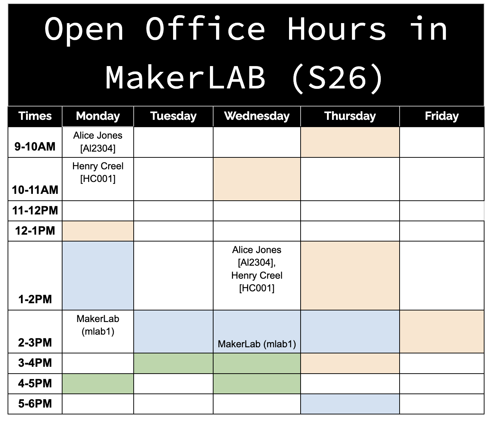
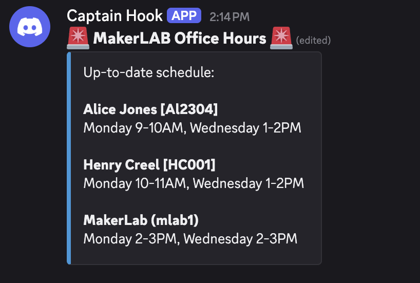

# Google-table-to-Discord
Google Apps Script to automatically send Google Doc table changes to a Discord Webhook.

# MakerLAB Discord Automator 📅

A serverless integration that automatically synchronizes a schedule from a Google Doc table directly to a Discord server. 

##  The Goal
MakerLAB needed an automated way to communicate changing Office Hours to students on Discord. This project turns a standard Google Doc table into a data source that feeds directly into Discord.

##  System Architecture
This project uses a lightweight, serverless architecture to move data from Google to Discord:
1. **Data Source (UI):** A standard Google Doc containing a formatted table. 
2. **Compute & Logic:** Google Apps Script reads the Document Object Model (DOM), parses the table into a JSON object, and groups available hours by staff member.
3. **State Management:** The script utilizes Google's `PropertiesService` to store the previous state of the table and the specific Discord Message ID, allowing it to compare versions and know exactly which message to edit.
4. **Automation:** A Google Apps Script Time-driven Trigger acts as a cron job, silently running the script every 30 minutes.
5. **API Delivery:** If a change is detected, the script constructs an embed payload and sends an HTTP `PATCH` request to a Discord Webhook, silently updating the live roster in the channel.

##  Features
* **Silent Background Checking:** Runs on a time trigger to check for updates without eating up Google API quotas.
* **Message Editing:** Uses `PATCH` requests to continuously edit a single Discord message, keeping the channel clean.
* **Format Resilience:** Designed to handle multiple names in a single cell and ignore empty columns to prevent crashes.
* **Two Layout Options:** The repository includes two different scripts depending on how you want the Discord message to look:
  * **Option A (Grouped By Day):** Organizes the schedule by the days of the week (e.g., all Monday shifts listed together). Best for quick daily check-ins.
  * **Option B (Grouped By Person):** Organizes the schedule alphabetically by staff member. Best for finding a specific person's availability.
 
##  Screenshots
* **Google Doc Table:**
  

* **Discord Master Message (Grouped By Day):**
  

##  Setup Instructions

### 1. Discord Preparation
1. Go to your Discord Server Settings > Integrations > Webhooks.
2. Create a new Webhook, assign it to your desired update channel (e.g., `#office-hours`), and **Copy the Webhook URL**.

### 2. Google Doc Preparation
1. Create a **dedicated** Google Doc for your schedule (see Best Practices below).
2. Insert a table with this specific structure:
   * **Row 1 (Top Row):** A merged title row (e.g., "MakerLAB Open Office Hours").
   * **Row 2:** The days of the week (starting with "Monday" in the second column).
   * **First Column:** The time slots.
   * **Intersecting Cells:** The names of the staff members available at those times (separated by commas).
  
### 3. Apps Script Installation
1. In your Google Doc, go to **Extensions > Apps Script**.
2. Delete any existing code and paste the contents of `Code.js` from this repository.
3. Open this repository and choose your layout format:
   * Copy the code from `Code.js` for (grouped by day layer) **OR** 
   * Copy the code from `Code_Grouped_By_Person.js`.
4. Paste the code into the Apps Script editor.
5. Replace `"Discord_Webhook_Here"` at the top of the script with your actual webhook URL.
6. Save the project.

### 4. Initialization & Triggers
1. **Set the Baseline:** Run the `checkTableUpdates` function manually one time in the Apps Script editor. You will need to accept Google's authorization prompts. This saves the initial state of the table and generates the first master message in Discord.
2. **Automate It:** Click the **Triggers** icon (alarm clock) on the left menu. Add a new trigger to run `checkTableUpdates` as a **Time-driven** event, checking every **15 or 30 minutes**.

## ⚠️ Best Practices & Limitations
* **The Dedicated Document Rule:** This script is programmed to read the *very first table* it finds in the document (`tables[0]`). To prevent the script from breaking, **do not add other tables above the schedule**. It is highly recommended to use a standalone Google Doc solely for this schedule to avoid accidental formatting errors from other collaborators.
* **Text and Images:** Paragraphs, titles, and images placed above or below the table are completely ignored by the script and will not cause any issues.

